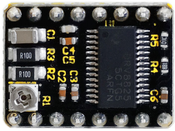
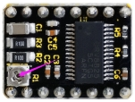

# KS0141 keyestudio DRV8825 stepper motor driver for 3D printer

## 1. Introduction

The DRV8825 stepper motor driver carrier is a breakout board for TI’s DRV8825 microstepping bipolar stepper motor driver.

The module has a pinout and interface that are nearly identical to those of our A4988 stepper motor driver carriers, so it can be used as a higher-performance drop-in replacement for those boards in many applications.

The DRV8825 features adjustable current limiting, over-current and over-temperature protection, and six microstep resolutions (down to 1/32-step). 

It operates from 8.2-45V and can deliver up to approximately 1.5A per phase without a heat sink or forced air flow (rated for up to 2.2 A per coil with sufficient additional cooling).

## 2. Specification

- Suitable for driving stepper motors within 8.2V~45V 2.5A；
- Simple step and direction control interface;
- Six different step resolutions: full-step, half-step, 1/4-step, 1/8-step, 1/16-step, and 1/32-step;
- Adjustable current control lets you set the maximum current output with a potentiometer, which lets you use voltages above your stepper motor’s rated voltage to achieve higher step rates
- Intelligent chopping control that automatically selects the correct current decay mode (fast decay or slow decay);
- Over-temperature thermal shutdown, over-current shutdown, and under-voltage lockout;
- Short-to-ground and shorted-load protection.

## 3. Adjusting Drive current

- When use the DRV8825 to drive the stepper motor, we can turn the potentiometer on the A4988 module to adjust the upper limit of the output current.

The voltage between the marked potentiometer and GND is **VREF**.

- The calculation formula of the current upper limit is **I=2\*VREF** , **VREF=0.5I**
- The current limit of the module is 2.5A, so **VREF=2.5\*0.5**, that is, 1.25V.